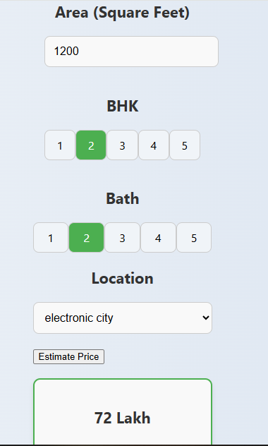

```markdown
 House Price Prediction

This project uses machine learning to predict house prices based on various features such as area (square feet), number of bedrooms, number of bathrooms, and location (specifically in India). The project is built using Flask for the backend, where we expose an API to handle the predictions and provide a web interface for user interaction.

Features:
- Predict house prices based on square footage, number of bedrooms, number of bathrooms, and location.
- User-friendly web interface where users can enter details and get an estimated price.
- API for programmatic access to the house price prediction model.

Technologies Used:
- Flask: A lightweight Python web framework used for building the server-side logic.
- scikit-learn: Used for machine learning and model training.
- Pandas & NumPy: Used for data processing.
- HTML/CSS/JavaScript: Frontend for the web interface.
- JQuery: To handle the frontend requests and communicate with the Flask backend.

Installation:

Follow these steps to run the project on your local machine:

Step 1: Clone the repository
```bash
git clone https://github.com/Omeche/DL-Projects.git
cd DL-Projects
```

Step 2: Install dependencies
Make sure you have Python 3.x installed. Then install the required Python libraries using pip:
```bash
pip install -r requirements.txt
```

Step 3: Start the Flask server
Run the following command to start the Flask server:
```bash
python server.py
```
This will start the server on `http://127.0.0.1:5000`.

Step 4: Open the web interface
Open your web browser and go to `http://127.0.0.1:5000`. You will be able to input the square footage, number of bedrooms, bathrooms, and location to get the estimated house price.

## API Endpoints

`/get_location_names`
Method: GET

Description: Returns a list of available locations for the house price prediction.

Response Example:
```json
{
  "locations": ["Electronic City", "Rajaji Nagar", "Koramangala", "Whitefield"]
}
```

 `/predict_prices`
Method: POST

Description: Predicts the house price based on the provided input parameters. 

Request Body Example:
```json
{
  "sqft": 1200,
  "bedroom": 2,
  "bath": 2,
  "location": "Electronic City"
}
```

Response Example:
```json
{
  "estimated price": 72
}
```
Sample UI


Contributing

I welcome contributions! If you'd like to improve the project, feel free to fork the repository, make changes, and create a pull request. Here are some ways you can contribute:
- Bug fixes
- New features
- Documentation improvements

License

This project is open-source.

Acknowledgments
- Flask - For providing the web framework.
- scikit-learn - For the machine learning tools used to create the predictive model.
- JQuery - For making AJAX requests and managing frontend interactions.
- Bootstrap - For styling the frontend interface.


Feel free to contact me via [email](mailto:omechetochi@gmail.com) for any questions or issues regarding the project.
```


